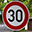

## Project: Build a Traffic Sign Recognition Program

Overview
---
In this project I have built a CNN network based on the LeNet architecture.
---
**Project Goals**

* Load the data set (zipped in data folder in repo)
* Explore, summarize and visualize the data set
* Design, train and test a model architecture
* Use the model to make predictions on new images
* Analyze the softmax probabilities of the new images
* Summarize the results with a written report

### Dependencies
I used the starter kit provided by Udacity:

* [CarND Term1 Starter Kit](https://github.com/udacity/CarND-Term1-Starter-Kit)

The lab environment can be created with CarND Term1 Starter Kit. Click [here](https://github.com/udacity/CarND-Term1-Starter-Kit/blob/master/README.md) for the details.

### Example Images

Here are a few examples images of German traffic signs.

[//]: # (Image References)

---
### Source Code

Here is a link to my [jupyter project code](https://github.com/matthewsommer/Traffic-Sign-Classifier/blob/master/Traffic_Sign_Classifier.ipynb)

### Data Set Summary & Exploration

* The size of training set is 34799
* The size of the validation set is 4410
* The size of test set is 12630
* The shape of a traffic sign image is (32, 32, 3)
* The number of unique classes/labels in the data set is 43

### Exploratory visualization of the dataset.

Here is a chart of number of images per label in the training data. This illustrates that there are underrepresented labels. It would be best to add more data for these labels.

### Design and Test a Model Architecture

I've normalized all the image data to help the model converge and not overfit when training the data and making a prediction of the image. By normalizing the RGB values the data has close to zero mean and standard deviation.

To help train I also normalized the counts of each sign image. Some of the classifications did not have enough data to train the model. I augmented the underrepresented signs by randomly copying one of it's instances and doing a random transformation to it. I wanted to pick a random instance of a sign so as not to have too much duplicate data which wouldn't help train the model.

To transform the images I'm using just two methods, scaling and rotation. I'm able to get a good accuracy with these transformation so I didn't add any more. If i wanted to improve this I would add a brightness or contrast transformation. I also might use this brightness/contrast transformation on some of the training images as they are very dark.

I did not transform any of the original data (other than normalization) as I thought it best to leave it as it was and only augument the data with transformed versions of the original data.

### Neural Net Model Architecture

My final model is the LeNet model with dropouts added.

| Layer or Operation    |     Description	        					| 
|:---------------------:|:---------------------------------------------:| 
| Input         		| 32x32x3 RGB image   							| 
| Convolution        	| 1x1 stride, VALID padding, outputs 28x28x6 	|
| RELU					|												|
| Max pooling	      	| 2x2 stride, VALID padding, outputs 14x14x6	|
| Convolution   	    | 1x1 stride, VALID padding, outputs 10x10x16   |
| RELU and Dropout		|		        								|
| Max pooling	      	| 2x2 stride, VALID padding, outputs 5x5x16	    |
| Flatten   	      	| Outputs 400	                                |
| Fully connected		| Output 120        							|
| RELU and Dropout		|		        								|
| Fully connected		| Output 84        		    					|
| RELU and Dropout		|		        								|
| Fully connected		| Output 43        		    					|
 

### Training Parameters

To train the model I used a batch size of 128, 20 epochs, and the AdamOptimizer. My learning rate is 0.001.

### Training Results

My final model results were:
* training set accuracy of 98.4%
* validation set accuracy of 95.2%
* test set accuracy of 93.1%

I started with the LeNet architecture and added dropout. If I had more time I would switch to a more modern architecture but the LeNet works well for this project. When I started I realized that I would not get good results with the data that I had because some of the labels did not have enough data compared to others, so I decided to create some more data. I tried adjusting the learning rate up and down but found that 0.0001 worked well to get the accuracy up.
 
### Testing the Model on New Images

Here are the results of the prediction:

| Image			        |     Prediction	        					| 
|:---------------------:|:---------------------------------------------:| 
| Ahead Only      		| Ahead Only   									| 
| Yield     			| Yield 										|
| 30 km/h				| 30 km/h										|
| Stop  	      		| Stop      					 				|
| General Caution		| General Caution      							|

The model was able to correctly guess 5 of the 5 traffic signs, which gives an accuracy of 100%. This is promising results but the data set is so small that isn't that meaningful. The speed limit sign was probably the hardest to determine given how similar it is to the other speed limit signs (as evidenced by softmax below).

## Softmax Predictions for each image

For the first image, the model is very certain that the sign is Ahead only, which it is. The top five soft max probabilities are:

| Probability         	|     Prediction	        					| 
|:---------------------:|:---------------------------------------------:| 
| 1.00         			| Ahead Only (35)								| 
| .00     				| Turn Right Ahead (33)							|
| .00					| Go Straight or Right (36)						|
| .00	      			| Turn Left Ahead (34)			 				|
| .00				    | Yield (13)                					|

For the second image the model is predicting Yield which it is. The top five soft max probabilities are:

| Probability         	|     Prediction	        					| 
|:---------------------:|:---------------------------------------------:| 
| 1.00         			| Yield (13)   									| 
| .00     				| Priority road (12)							|
| .00					| No Vehicles (15)								|
| .00	      			| Stop (14)     				 				|
| .00				    | 20 km/h (0)        							|

For the third image the model is predicting 30 km/h which it is. The top five soft max probabilities are:

| Probability         	|     Prediction	        					| 
|:---------------------:|:---------------------------------------------:| 
| .99         			| 30 km/h (1)   								| 
| .00     				| 50 km/h (2)   								|
| .00					| 20 km/h (0)									|
| .00	      			| 80 km/h (5)					 				|
| .00				    | 70 km/h (4)      		    					|

For the fourth image the model is predicting Stop which it is. The top five soft max probabilities are:

| Probability         	|     Prediction	        					| 
|:---------------------:|:---------------------------------------------:| 
| .99         			| Stop (14)    									| 
| .001     				| Bicycles Crossing (29)						|
| .00					| No Entry (17)									|
| .00	      			| Yield (13)	        		 				|
| .00				    | Right-of-way at the next intersection (11) 	|

For the fifth image the model is predicting General Caustion which it is. The top five soft max probabilities are:

| Probability         	|     Prediction	        					| 
|:---------------------:|:---------------------------------------------:| 
| .99         			| General Caustion (18) 						| 
| .00     				| Pedestrians (27) 								|
| .00					| Traffic Signals (26)							|
| .00	      			| Right-of-way at the next intersection (11) 	|
| .00				    | Road narrows on the right (24)				|